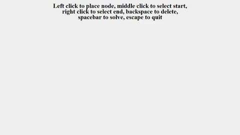

# minimum_path_solver

This python script, minimum_path_solver.py, functions as an interactive way to create graphs and visualize finding a minimum path. The tkinter library is used as GUI. I based the graph structure off of an implementation found here: https://runestone.academy/runestone/books/published/pythonds/Graphs/Implementation.html

The first phase is creating the graph. The controls are as follows:

* Left click -- create and connect nodes
* Middle click -- designate start node, marked as green
* Right click -- designate end node, marked as red
* Backspace -- delete node below cursor
* Space -- freeze graph and solve if start and end node are designated
* Escape -- exit

Once the graph is created, the start and end nodes are assigned, and spacebar is hit, the script will attempt to find the minimum path. It changes the color of each node to light blue as it is parsed, and within it prints each node's distance from the start.

When the end node is found, the minimum distance is printed and the minimum path is marked as a darker blue.

If the algorithm runs out of nodes to parse and still hasn't found the end, it recognizes the graph is disconnected and stops.

Here is a simple example of the application:

A more complex example:

